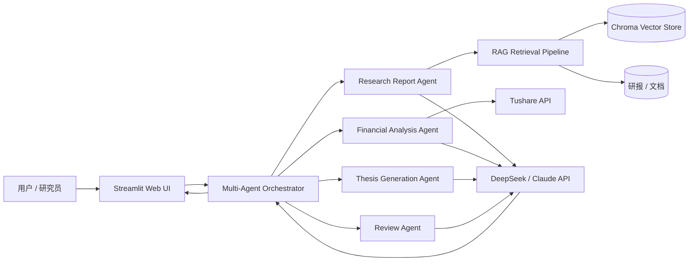

# AI Investment Research Assistant

> 基于 **LLM + RAG + Multi-Agent** 的智能投研辅助系统

## 📖 项目简介

AI Investment Research Assistant 是一个面向个人投资者与研究人员的投研辅助项目，聚焦研报解读、金融指标分析和投资论点生成等常见研究任务。系统使用 RAG（Retrieval-Augmented Generation）检索研报及结构化金融数据，并通过多个职责明确的 Agent 协作完成信息提取、分析与结果整合，降低长篇材料阅读和基础研究整理的时间成本。

项目重点展示 LLM 应用工程、知识检索、Multi-Agent 工作流、金融数据处理和交互式产品开发能力；系统输出强调来源可追溯与分析边界，不替代专业投资判断。

## ✨ 核心功能

- **研报智能解读**：上传 PDF 等研究材料，提取关键信息并生成结构化摘要与问答结果。
- **RAG 知识检索**：对研报进行切分、Embedding 和向量检索，为回答提供相关上下文及来源依据。
- **金融指标分析**：通过 Tushare 获取行情与财务数据，辅助分析估值、盈利能力和成长性等指标。
- **投资论点生成**：从业务、财务和风险等维度整理 Bull Case、Bear Case 与待验证假设。
- **Multi-Agent 协作**：由检索、数据分析、论点生成和结果审阅等 Agent 分工完成研究流程。

## 🏗️ 技术架构



**主要技术栈：** Python 3.11、LangChain、DeepSeek / Claude API、Chroma、Streamlit、Tushare。

## 🚀 快速开始

### 1. 环境要求

- Python 3.11
- Git
- 至少一个可用的 LLM API Key（DeepSeek 或 Claude）
- Tushare Token（使用金融数据功能时需要）

### 2. 克隆项目

```bash
git clone https://github.com/<your-username>/<repository-name>.git
cd <repository-name>
```

### 3. 创建虚拟环境并安装依赖

```bash
python3.11 -m venv .venv
source .venv/bin/activate       # macOS / Linux
# .venv\Scripts\activate        # Windows PowerShell

pip install -r requirements.txt
```

### 4. 配置环境变量

复制示例配置文件：

```bash
cp .env.example .env
```

在 `.env` 中填写所需凭证：

```dotenv
# 至少配置一个 LLM Provider
DEEPSEEK_API_KEY=your_deepseek_api_key
ANTHROPIC_API_KEY=your_anthropic_api_key

# 金融数据服务
TUSHARE_TOKEN=your_tushare_token

# 可选：模型及本地存储配置
LLM_PROVIDER=deepseek
CHROMA_PERSIST_DIR=./data/chroma
```

> 请勿将 `.env` 或任何真实 API Key 提交到 Git 仓库。

### 5. 启动应用

```bash
streamlit run app.py
```

启动后，根据终端提示在浏览器中访问本地地址（默认通常为 `http://localhost:8501`）。

## 📁 项目结构

```text
ai-investment-research-assistant/
├── app.py                    # Streamlit 应用入口
├── agents/                   # Multi-Agent 定义与协作逻辑
│   ├── report_agent.py       # 研报解读 Agent
│   ├── financial_agent.py    # 金融指标分析 Agent
│   ├── thesis_agent.py       # 投资论点生成 Agent
│   └── review_agent.py       # 结果审阅 Agent
├── rag/                      # RAG 数据处理与检索链路
│   ├── loaders.py            # 文档加载与解析
│   ├── splitter.py           # 文本切分
│   ├── embeddings.py         # Embedding 配置
│   └── retriever.py          # Chroma 检索封装
├── services/                 # 外部服务与模型接口
│   ├── llm.py                # DeepSeek / Claude 调用封装
│   └── tushare_client.py     # Tushare 数据接口
├── workflows/                # 投研任务编排流程
├── prompts/                  # Prompt 模板
├── data/
│   ├── reports/              # 本地研报文件（默认不提交）
│   └── chroma/               # Chroma 持久化数据（默认不提交）
├── tests/                    # 单元测试与集成测试
├── .env.example              # 环境变量示例
├── requirements.txt          # Python 依赖
└── README.md
```

> 上述目录展示目标工程结构，可根据实际开发进度逐步补齐。

## 🗺️ 开发路线图

- [x] 完成项目定位、技术选型与基础架构设计
- [x] 建立 README、环境变量和目录规范
- [ ] **进行中：** 实现研报加载、文本切分与 Chroma 向量检索
- [ ] **进行中：** 封装 DeepSeek / Claude 模型调用与 Provider 切换
- [ ] **待开始：** 接入 Tushare 行情及财务指标数据
- [ ] **待开始：** 实现 Multi-Agent 任务编排与交叉审阅机制
- [ ] **待开始：** 完成 Streamlit 交互界面与引用来源展示
- [ ] **待开始：** 增加自动化测试、评估数据集与 RAG 质量指标
- [ ] **待开始：** 增加缓存、调用成本统计及异常处理
- [ ] **待开始：** 部署可访问的演示版本并补充 Demo 截图

## ⚠️ 免责声明

本项目仅用于技术研究、学习交流与作品展示。系统生成的内容可能存在遗漏、延迟或错误，不构成任何形式的投资建议、证券分析意见、收益承诺或交易依据。使用者应独立核验数据与结论，并自行承担基于相关信息作出决策的风险。金融数据及第三方内容的使用还应遵守对应数据源、API 服务和内容提供方的许可条款。

## 📄 License

本项目采用 [MIT License](LICENSE)。
